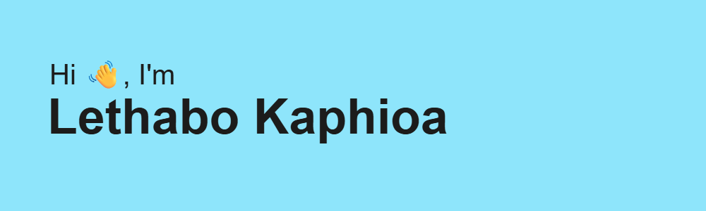

<h1 align="center">Hi 👋, I'm Lethabo Kaphioa</h1>

<h3 align="center">🚀 Full-Stack Engineer </h3>

---

### 🧠 More About Me 

* 🎓 Full-Stack Web Development and Software Engineering Graduate (HyperionDev)
* 💻 I build **end-to-end applications** with a strong focus on **clean code, structure, and scalability**
* 🧩 Passionate about understanding how systems work beyond just making them function
* 📈 Constantly improving through building, breaking, and refining real-world projects

---

### ⚡ What I Focus On

* 🏗️ Designing and building **full-stack applications**
* 🔗 Writing **maintainable and scalable backend logic**
* 🧠 Applying **software engineering principles** (modularity, separation of concerns, clean architecture)
* 🔄 Connecting frontend, backend, and databases into cohesive systems

---

### 🧰 Tech Stack

<h3 align="left">Languages and Tools:</h3>

  
  
  
  
  
  
  
  
  
  
  
  
  
  
  

---

### 🏗️ Engineering Principles

* Clean & readable code
* Separation of concerns
* Reusable components
* RESTful API design
* Basic system design thinking

---

### 📊 GitHub Stats

  
  

---

### 📂 Featured Projects

<!-- Replace with real projects -->

* 🔹 Credential Manager – Full-stack app with authentication and REST API design

---

### 🤝 Connect With Me

---

### ⚔️ Developer Mindset

> “I don’t just build applications — I engineer systems that are structured, scalable, and maintainable.”

---

